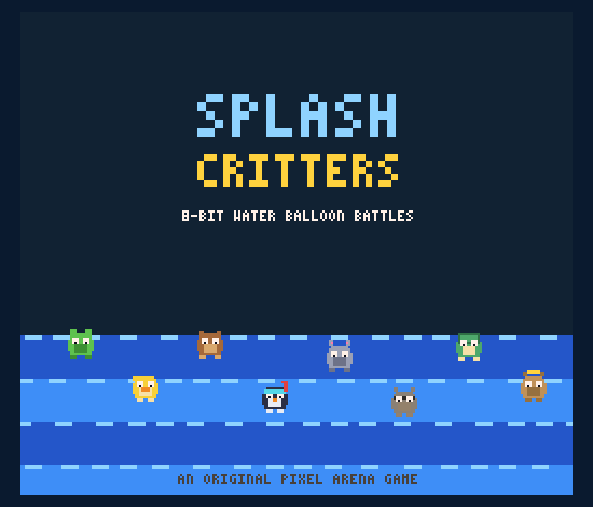
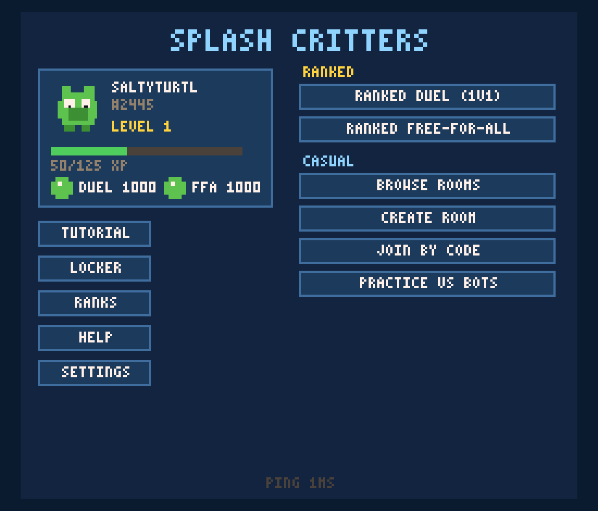
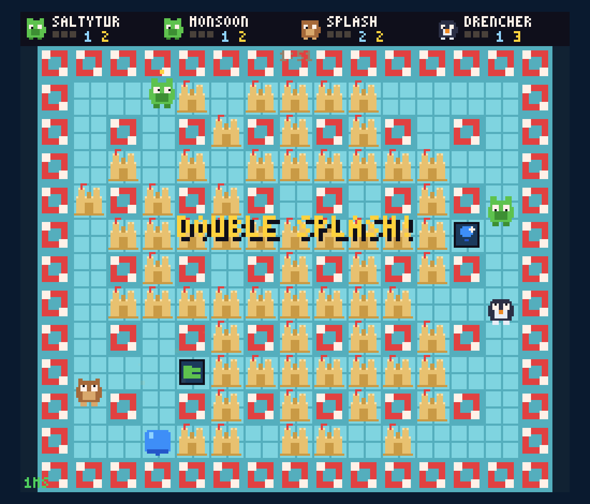
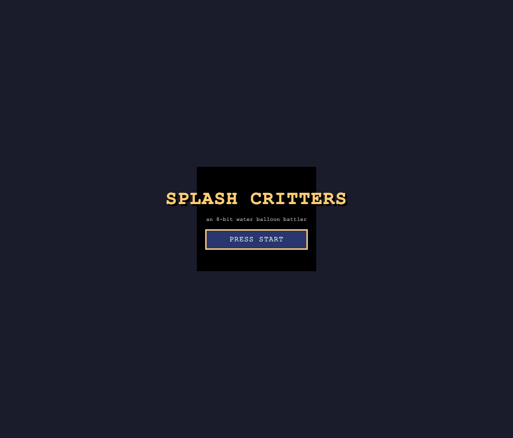
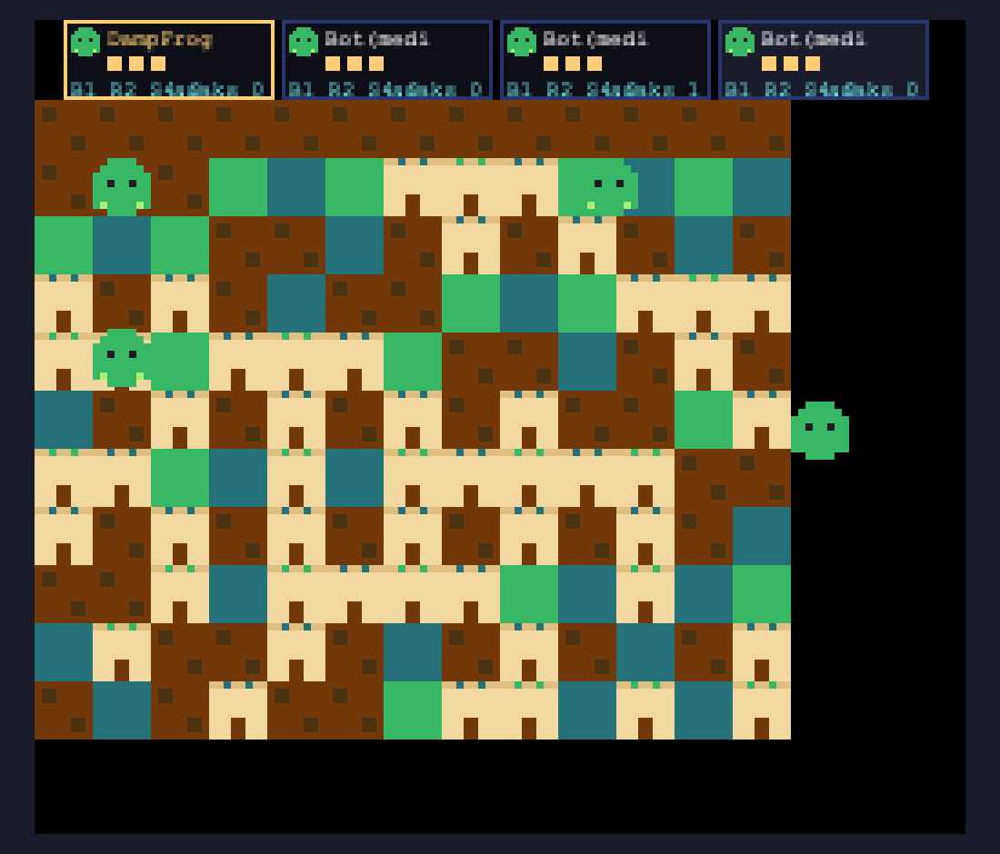
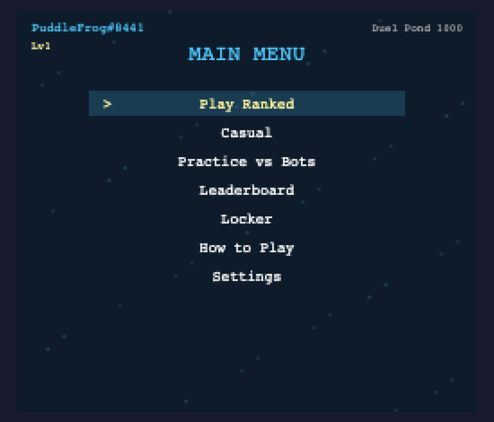
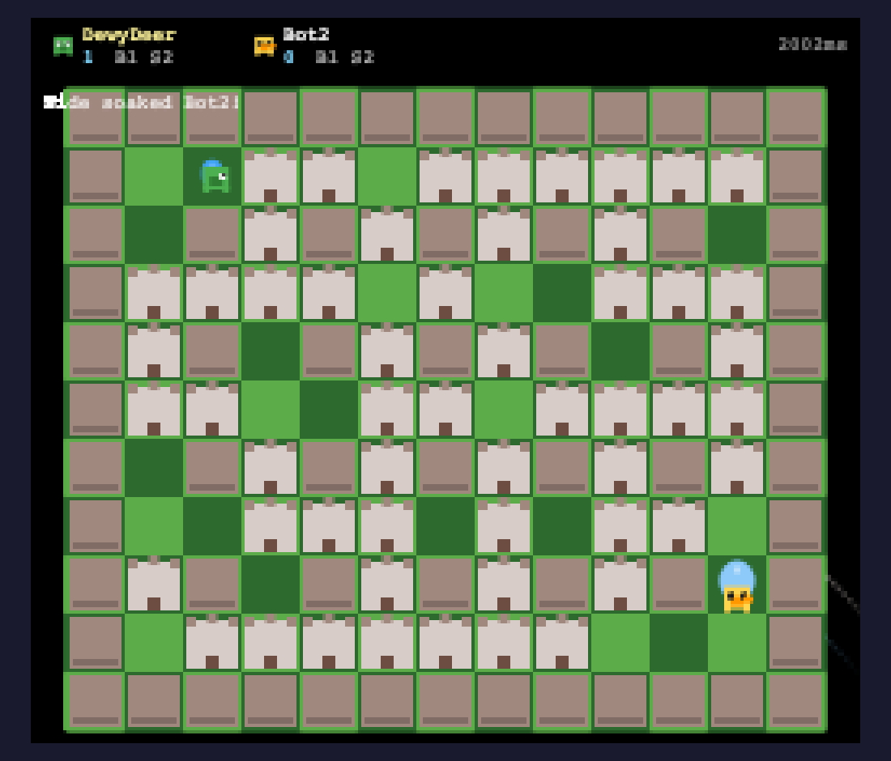
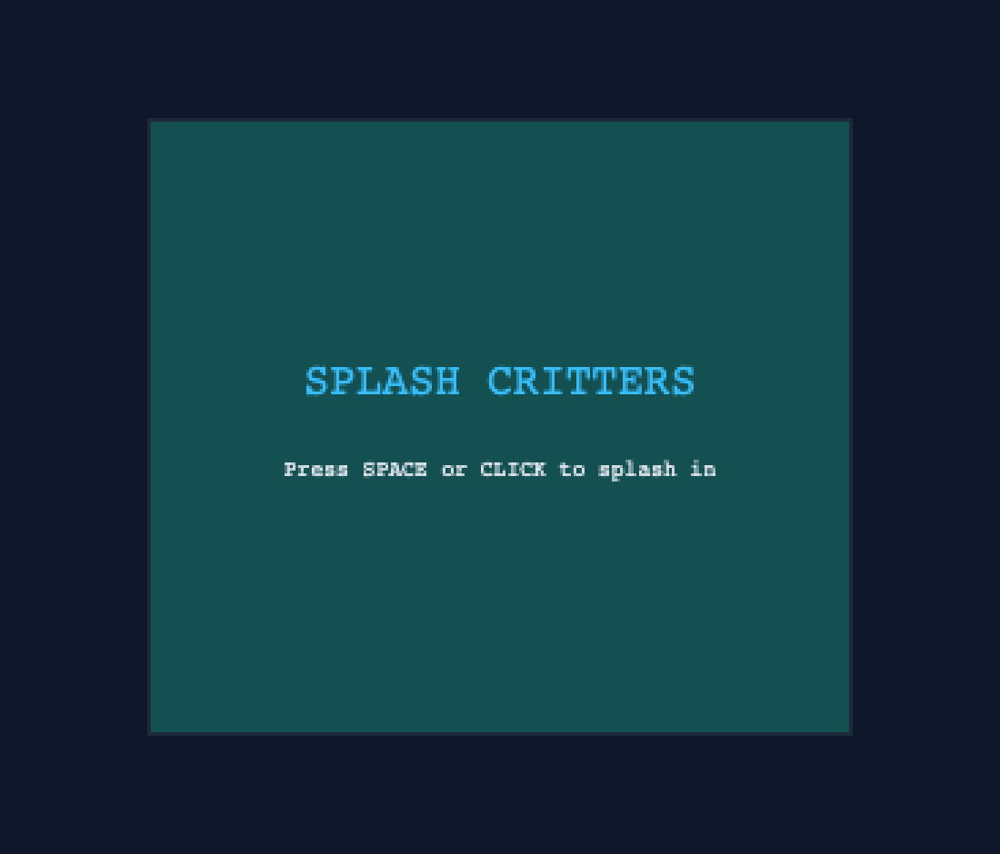

# Splash Critters — one prompt, five AI coding agents

An experiment: give five frontier LLM coding setups the **same ~200-line spec** —
build a complete, shippable 8-bit online multiplayer water-balloon battler
(deterministic shared sim, server-authoritative netcode, bots, ranked Elo,
SQLite, lobby browser, cosmetics, procedural pixel art) — and compare what
comes back, untouched.

The full prompt is in [`prompt.md`](prompt.md). Each agent's output is
committed verbatim under [`results/`](results/) (only `node_modules/`, build
output, and database files were stripped).

> **Disclosure:** this comparison README was compiled by **Claude Fable 5 —
> one of the contestants.** Every claim below comes from a scripted,
> reproducible check (harness + raw logs + screenshots are in
> [`comparison/`](comparison/)), and the one evaluation mistake made along the
> way (which initially made *both Kimi builds look broken when they weren't*)
> is documented in the Methodology section. Judge for yourself.

## Contenders

| Folder | Setup |
| --- | --- |
| [`results/fable-5/`](results/fable-5/) | **Claude Fable 5** (Claude Code, single agent) |
| [`results/glm-5.2/`](results/glm-5.2/) | **GLM 5.2** (zcode) |
| [`results/kimi-k2.7/`](results/kimi-k2.7/) | **Kimi K2.7** (opencode) |
| [`results/kimi-k2.6-agent-swarm/`](results/kimi-k2.6-agent-swarm/) | **Kimi K2.6 agent swarm** (multi-agent; its own `plan.md`/`SPEC.md` orchestration artifacts are included) |
| [`results/grok-4.5/`](results/grok-4.5/) | **Grok 4.5** (added to the experiment two weeks after the first four; same prompt, same gauntlet) |

## Scoreboard

Same machine (macOS, Node 23), same gauntlet for everyone
([`comparison/harness/evaluate.sh`](comparison/harness/evaluate.sh)):
`npm install` → `npm test` → `npm run build` → `npm start` → `/health` →
client served → headless browser probe.

| Check | Fable 5 | GLM 5.2 | Kimi K2.7 | K2.6 swarm | Grok 4.5 |
| --- | :-: | :-: | :-: | :-: | :-: |
| `npm install` | ✅ | ✅ | ✅ | ✅ | ✅ |
| `npm test` (own suite) | ✅ 28 tests | ✅ 12 tests | ✅ 7 tests | ✅ 26 tests | ✅ 14 tests |
| `npm run build` | ✅ | ✅ | ✅ ¹ | ✅ ¹ | ✅ |
| Server boots, `/health` OK | ✅ | ✅ | ✅ | ✅ | ✅ |
| Built client served on one port | ✅ | ✅ | ✅ | ✅ | ✅ |
| **Client loads in a browser** | ✅ | ✅ | ✅ | ❌ crashes on load ² | ✅ |
| **A player can actually connect** | ✅ | ✅ | ❌ server crashes ³ | ❌ | ✅ |
| **Full match playable vs bots** | ✅ | ✅ | ❌ | ❌ | ✅ |
| Bot-vs-bot soak script | ⚠️ flaky ⁴ | ✅ ⁵ | ✅ ⁵ | ❌ broken ⁶ | ✅ ⁵ |
| E2E acceptance script included | ✅ passes | — | — | — | — |

¹ Both Kimi zips shipped **prebuilt `dist/` folders plus stale
`tsconfig.tsbuildinfo`** files. After stripping `dist/` (as this repo does),
the stale buildinfo makes `tsc` no-op ("already built") and `npm run build`
fails. Deleting the buildinfo files — i.e., building from genuinely clean
sources — both builds pass. The scoreboard shows the clean-source result.

² **K2.6 swarm:** the client throws
`ReferenceError: Cannot access 'DEFAULT_SETTINGS' before initialization`
(a circular-import TDZ bug) the moment the page loads — in the production
bundle *and* in Vite dev mode. No canvas ever mounts. The likely
multi-agent failure mode: modules written by parallel agents that never got
integration-tested together.

³ **Kimi K2.7:** the server process **crashes on the very first client
`hello`**: `SqliteError: incomplete input` from
`INSERT OR IGNORE INTO unlocks (player_id, item_id, unlocked_at)` — two of
the three default-unlock inserts are missing their `VALUES (?, ?, ?)`
clause. One missing SQL fragment, and no player can ever connect (there is
no error handling around it, so the whole process dies). Its soak test
passes because it bypasses the network/DB layer entirely.

⁴ **Fable 5's soak is the strictest of the five** — it asserts a *skill
ordering* (Hard bots must beat Easy bots in ≥70% of duels), not just
crash-freedom. Across 6 recorded runs the Hard-vs-Easy score was 9/10,
10/10, 6/10, 7/10, 6/10, 6/10 — i.e. it **failed its own bar half the
time**. Honest reading: Hard reliably *outperforms* Easy (~70% duel win
rate) but "reliably beats" at a 70% threshold is marginal. Logged as-is.

⁵ GLM's, K2.7's, and Grok 4.5's soak scripts assert only that a match
completes without crashing — no bot-skill assertion. (K2.7's duel soak logs
`winner: null`.)

⁶ **K2.6 swarm:** a soak script exists at `scripts/soak-test.mjs` but was
never wired into `npm run soak` and crashes immediately (it imports `.js`
paths that only exist as TypeScript source).

## How far can you actually get?

The spec's core acceptance test is a human one: open the game, reach the
menu, play a full match against bots.

| Stage | Fable 5 | GLM 5.2 | Kimi K2.7 | K2.6 swarm | Grok 4.5 |
| --- | :-: | :-: | :-: | :-: | :-: |
| Title screen renders | ✅ | ✅ | ✅ | ❌ blank page | ✅ |
| Guest account created | ✅ | ✅ | ❌ (server dead) | ❌ | ✅ |
| Main menu | ✅ | ✅ | ❌ stuck on title | ❌ | ✅ |
| Lobby / practice setup | ✅ | ✅ | ❌ | ❌ | ✅ |
| Live match vs bots | ✅ | ✅ | ❌ | ❌ | ✅ |

### Fable 5 — title / menu / live match

<p>
 
</p>
<p></p>

*Live 4-player match: pool theme, castles, revealed power-ups, kill-feed,
per-player HUD, and a "DOUBLE SPLASH!" chain announcement.*

### GLM 5.2 — title / live match

<p>
 
</p>

*GLM's match is real and running (3 Medium bots, backyard theme). Visuals
are rough — all four critters share one green sprite, the grid/HUD glyphs
misrender, and one critter draws outside the arena — but it plays.*

### Grok 4.5 — menu / live match

<p>
 
</p>

*Grok's game plays: keyboard-driven menu with guest account + rank badge, a
"How to Play" walkthrough that flows into a practice bout, and a working duel
vs a bot (castles, HUD, kill feed). Simpler visuals than Fable 5's and its
in-game ping readout is clearly wrong (steady "2002ms" on localhost), but the
loop works end to end.*

### Kimi K2.7 — permanently stuck at title

<p></p>

*"Press SPACE to splash in" — pressing it sends `hello`, which kills the
server (see ³). Every retry: `ERR_CONNECTION_REFUSED`.*

### K2.6 agent swarm — blank page

<p></p>

*The most interesting contrast in the experiment: the swarm produced the
second-largest codebase, near-best test count, all 12 screen files, and
detailed planning artifacts — and none of it is reachable behind a
client that crashes on load.*

## Static metrics

| Metric | Fable 5 | GLM 5.2 | Kimi K2.7 | K2.6 swarm | Grok 4.5 |
| --- | --: | --: | --: | --: | --: |
| TypeScript lines | 7,934 | 4,450 | 4,540 | 8,944 | 6,581 |
| TypeScript files | 53 | 30 | 40 | 39 | 43 |
| Unit tests | 28 | 12 | 7 | 26 | 14 |
| Client screen modules | 12 | 1 consolidated ⁷ | 11 | 12 | 12 |
| Extra verification shipped | soak + WS e2e script | soak | soak | (broken soak) | soak |

⁷ GLM consolidated all screens into one 400-line file. All spec screens are
present as functions **except the tutorial, which GLM skipped entirely**
(`grep -ri tutorial packages/` → 0 hits). The two Kimis, Grok 4.5, and
Fable 5 all implement the tutorial.

Feature-keyword footprint (case-insensitive grep hits across `packages/`,
a *rough* proxy for how deeply a mechanic is wired through sim + bots + UI):

| Keyword | Fable 5 | GLM 5.2 | Kimi K2.7 | K2.6 swarm | Grok 4.5 |
| --- | --: | --: | --: | --: | --: |
| kick | 57 | 15 | 28 | 78 | 15 |
| revenge (ducks) | 57 | 31 | 27 | 37 | 53 |
| tide | 55 | 42 | 26 | 33 | 40 |
| emote | 53 | 2 | 17 | 48 | 32 |
| rematch | 22 | 12 | 13 | 21 | 32 |
| tutorial | 28 | 0 | 15 | 11 | 31 |
| colorblind | 11 | 0 | 0 | 11 | 10 |
| reconcil… (netcode) | 3 | 5 | 0 | 10 | 1 |

## Methodology & fairness notes

- Every submission ran the **identical** gauntlet
  ([`comparison/harness/`](comparison/harness/)) on the same machine;
  trimmed raw logs are in [`comparison/logs/`](comparison/logs/).
- Zips were committed with `node_modules/`, `dist/`, and `*.db` stripped.
  **This initially broke both Kimi builds** (stale `tsconfig.tsbuildinfo`
  without their shipped `dist/` made `tsc` a no-op). That was an evaluation
  artifact, not their bug — the buildinfo files were deleted and both
  builds re-run clean, which is what the scoreboard reports.
- Both Kimis were additionally given a chance in **dev mode**
  (`npm run dev`): K2.7's Vite dev server fails on the same package-entry
  issue its build had before cleaning, and K2.6's client throws the same
  TDZ crash. The blocking bugs above are not artifacts of production
  bundling.
- **Grok 4.5 was added two weeks after the original four** (its zip is
  dated 2026-07-16 vs 2026-07-02 for the others) and ran the exact same
  harness; its zip was stripped identically (`node_modules/`, `dist/`,
  `*.tsbuildinfo`, databases). The Fable 5 folder remains the frozen
  2026-07-02 submission even though development continued in its source
  repo afterward.
- Fable 5's flaky soak result is reported exactly as measured (see ⁴) —
  its bot-skill assertion simply has a threshold its bots only clear
  ~half the time.
- Deeper flows (ranked queues, reconnects, rematch votes) were only
  end-to-end verified for Fable 5, via its own `scripts/e2e.mjs` (guest
  hello → room browser join → full 4p bot match with XP persistence →
  ranked queue → forfeit → Elo 1032/968 → leaderboard). The script is in
  its folder; the other three had no equivalent to run, and the two
  playable games were probed manually only as far as the tables above show.

## Reproduce

```bash
git clone https://github.com/indexsy/splash-critters-llm-comparison
cd splash-critters-llm-comparison/results/<model>
npm install
npm test
npm run build
npm start          # then open http://localhost:3000
```

For Fable 5's full acceptance suite: `npm run soak` and `node scripts/e2e.mjs`
from `results/fable-5/`.
